# PPMPのインストール

いままで

* [WikiStart/PPMPのインストール – HRDataScientistWG](http://textmagic.dip.jp/trac/HRDataScientistWG/wiki/WikiStart/PPMPのインストール)
* [WikiStart/PPMPのビジネスモデル – HRDataScientistWG](http://textmagic.dip.jp/trac/HRDataScientistWG/wiki/WikiStart/PPMPのビジネスモデル)

に置いてあったものをここに置いていきます。

## インストールの手順
  * [お試しの最新版(PPMP_v1.0)のダウンロード](https://drive.google.com/drive/folders/0B58FUymlrqh9TkwyRzUtcUpjXzQ?usp=sharing)
  * [PPMPの実行に必要なソフトのダウンロード](https://drive.google.com/open?id=1GH30fM0VXykWfeReTd3Wt19HRJTeSjJ5)
* 参考
  * [WikiStart/PPMPのビジネスモデル](https://github.com/t-magic/SOFT/wiki)
* 引っ越し前に作成したので、適当に読み変えてください。

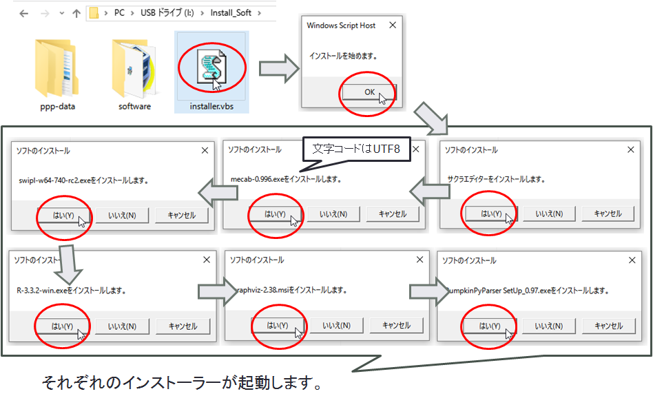

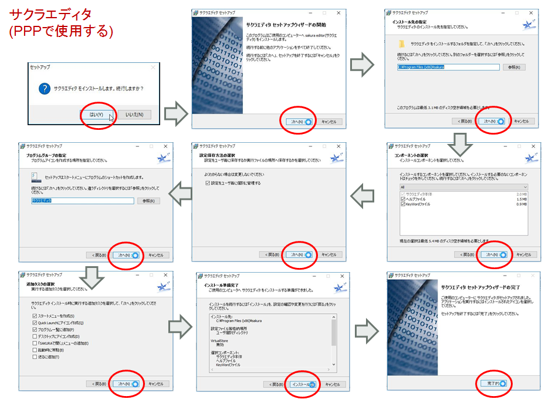

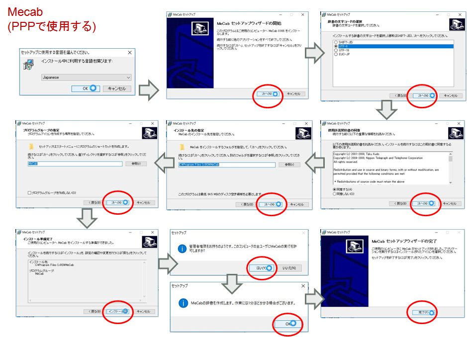

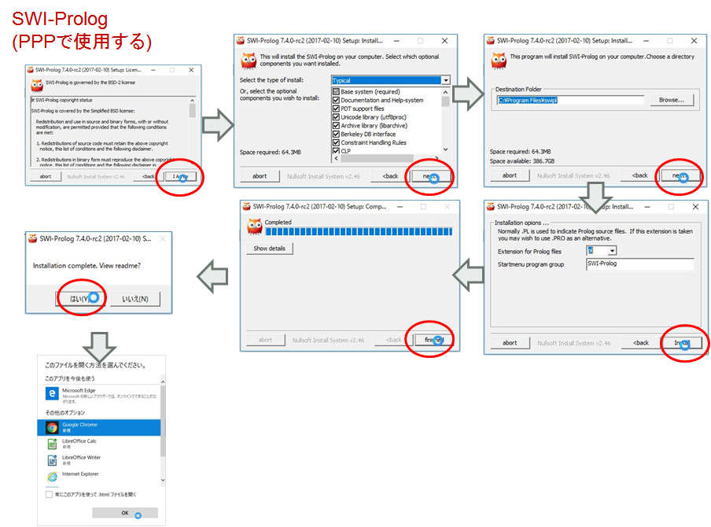

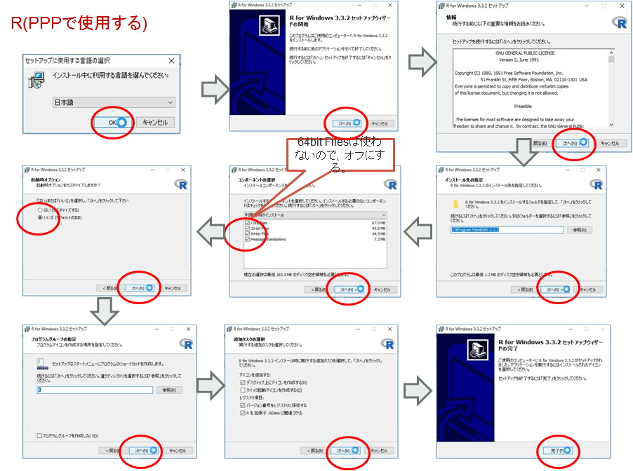

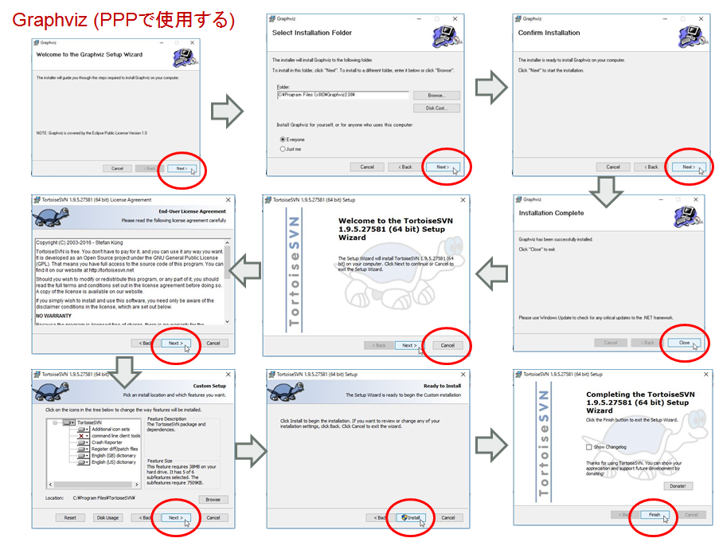

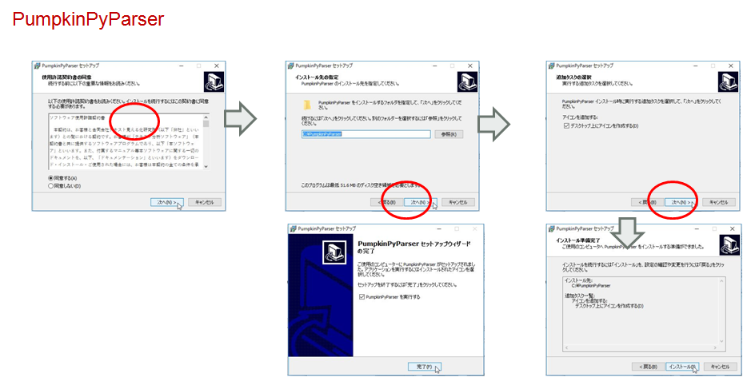

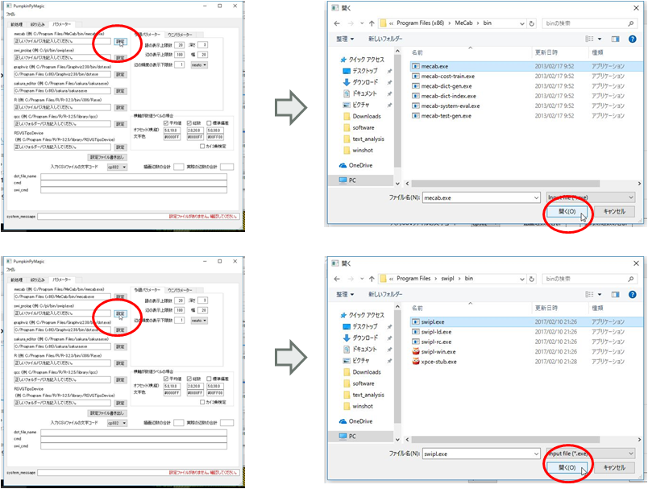

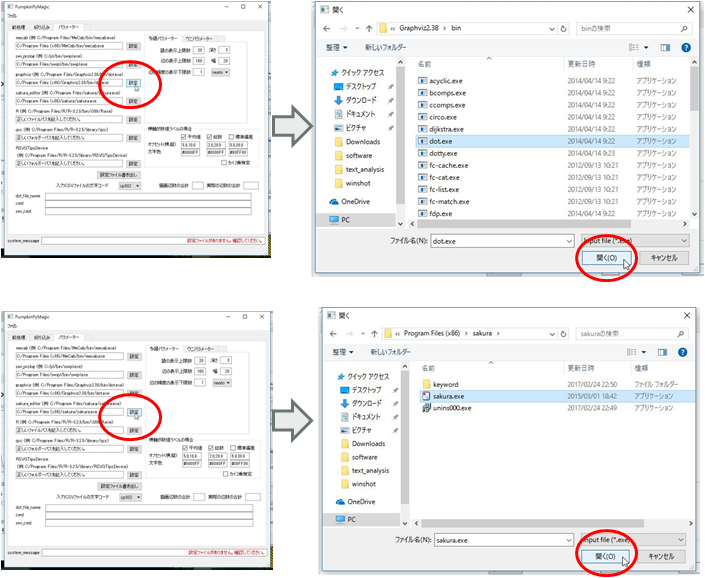

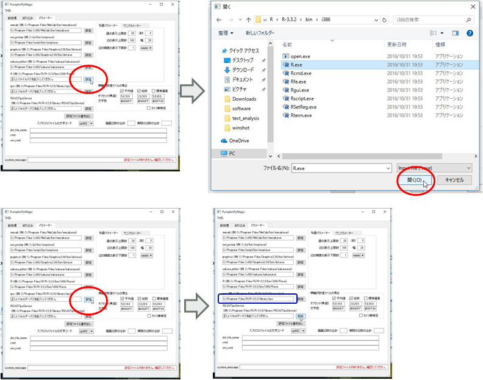

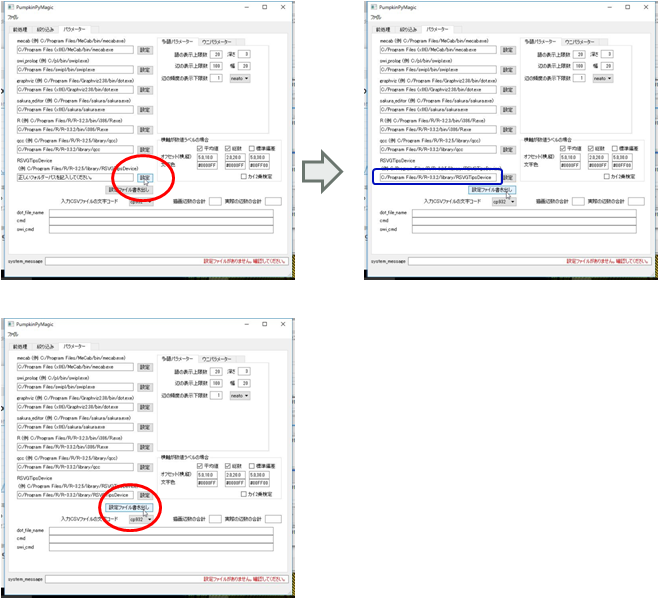

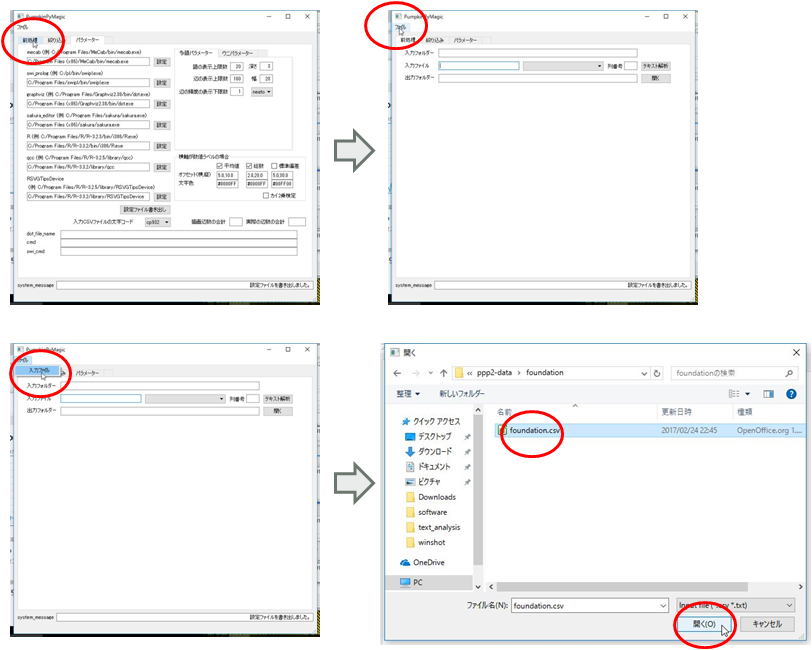

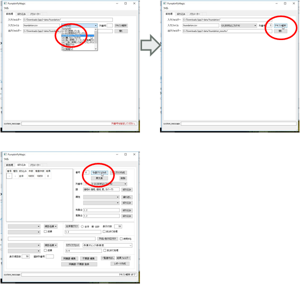
