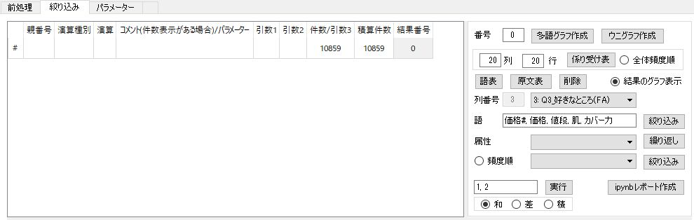

# TMRobo(PPMP)でどんなことができるか
### ファンデーションに関する女性10,000人のアンケートの見える化の例

---

## 多語グラフ
### 1. ノード数 = 20

## ウニグラフ
### 1. ノード数 = 20

---

### 2. ノード数 = 50

### 3. ノード数 = 30

---
## 語表

---

## 係り受け表

---

## 原文表
#### 注: 処理に時間がかかります。

#### 強制終了させるには
* タスクマネージャーで終了させてから、アプリを起動します。

   

---

## 実行履歴を削除するには

---

## 検索
### 「肌」を検索するには

---

### 「カバー力」で絞り込み検索するには

---

### 「肌」または「カバー力」で検索するには

---

## モザイクプロットを作成するには

---

## 比率差グラフを作成するには

[詳細](pict/foundation_3_検索_11.Q10_購入場所%28V%29_windsocks_fa3_v11_総数順_50.svg)

---

## 名義データを値別に絞り込むには

---

## 検索結果の和を求めるには

---

## 検索結果の差を求めるには

---

## 検索結果の積を求めるには

---

## 実行履歴を書き出すには

---

## 実行履歴を使って再実行するには

---

## 実行内容をレポートにまとめるには

---

## 同義語、不要語を登録するには

